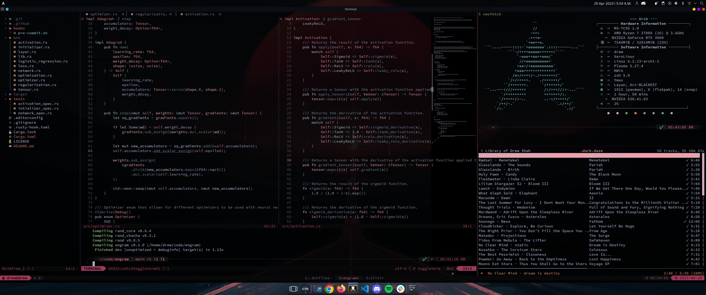

# Dotfiles

My alacritty/neovim/tmux/zsh configurations.

## Installation

Clone repo

```bash
git clone https://github.com/drewxs/dotfiles $HOME/.dotfiles
```

Install zsh/omz

```bash
source $HOME/.dotfiles/scripts/install_zsh.sh
```

Run from zsh

```bash
install_dotfiles
```

## Updating

```sh
# -f: rerun install
upd [-f]
```

Font - [Hack Nerd Font](https://github.com/ryanoasis/nerd-fonts/blob/master/patched-fonts/Hack/Regular/complete/Hack%20Regular%20Nerd%20Font%20Complete.ttf)

### Screenshot


